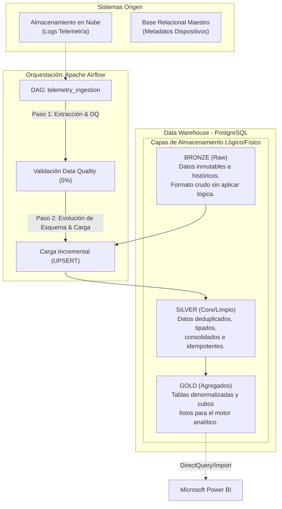

# Documentación Técnica Detallada: Arquitectura e Ingesta de Datos

---

## 🏗️ 1. Contexto del Negocio y Fundamentos del Diseño

La organización atraviesa un proceso de modernización de sus capacidades analíticas, migrando hacia un Data Warehouse (DWH) centralizado sobre PostgreSQL. Las fuentes primarias incluyen volúmenes masivos de telemetría provenientes de dispositivos IoT/Apps en almacenamiento en la nube (ej. AWS S3, Azure Blob) y cruces con datos maestros gestionados en bases relacionales (Oracle).

El principal reto técnico radica en la **Escalabilidad** y la **Integridad**:
1. **Volumen masivo:** La tabla destino (`fact_telemetry`) asimila 50 millones de registros mensuales (aprox. 1.6M diarios). 
2. **Evolución del Dato:** Los dispositivos pueden reportar nuevas métricas en cualquier momento, alterando el esquema de origen (CSV/JSON).
3. **Calidad:** Los logs pueden presentar corrupción en el tránsito de red, llegando con claves primarias o fechas nulas.

Para resolver esto, he diseñado un pipeline orquestado en **Apache Airflow** que aplica los principios de la Arquitectura Medallion, garantizando idempotencia, auto-descubrimiento de esquemas y validación estricta de Data Quality (DQ).

---

## 🏛️ 2. Arquitectura de Datos: El Paradigma Medallion

Se optó por implementar la **Arquitectura Medallion (Bronze / Silver / Gold)**. La justificación técnica detrás de esta decisión es la *separación de preocupaciones (Separation of Concerns)* y la auditabilidad.

### ¿Por qué esta estructura?
- **Bronze (Staging):** Responde a la necesidad de tener un "histórico exacto". Si la lógica de transformación (Silver) cambia en el futuro, o si se descubre un error de negocio, tener la capa Bronze permite reconstruir todo el DWH sin necesidad de volver a consultar los sistemas origen (los cuales pueden tener políticas de retención limitadas).
- **Silver (Fact/Dim):** Es la fuente de la verdad (SSOT). Aquí se resuelven los conflictos de concurrencia y se garantiza que no haya registros duplicados.
- **Gold (Curated):** Power BI (o cualquier motor BI) consume recursos intensivos si se ve obligado a agrupar 50 millones de filas "on-the-fly". La capa Gold precalcula estas agrupaciones (ej. promedios diarios por dispositivo), reduciendo el cómputo en la capa de visualización y mejorando la UX del usuario final por menores tiempos de respuesta.

---

## 🚀 3. Estrategia de Ingesta y Escalabilidad (50M de Registros)

### El problema del "Full Load"
Cargar 50 millones de registros mensuales usando `TRUNCATE` + `INSERT` es un antipatrón en Big Data. Reconstruir la tabla entera diariamente saturaría los recursos de I/O de la red, la memoria del servidor de base de datos y provocaría tiempos de inactividad inaceptables (bloqueos de tabla prolongados).

### La Solución: Particionamiento y Carga Incremental

1. **Particionamiento Lógico en Airflow (`ds`):**
   El DAG está diseñado para operar estrictamente dentro del marco temporal definido por su `logical_date` (antiguamente execution_date). Cada ejecución solo lee el delta (el archivo) que corresponde al día/hora específico. Esto se inyecta vía `kwargs.get('logical_date')`.

2. **Particionamiento Físico en PostgreSQL (Rango por Fecha):**
   A nivel de DWH, la tabla `fact_telemetry` debe particionarse físicamente por `timestamp`.
   *Justificación:* El optimizador de consultas de Postgres usa *Partition Pruning*. Si Power BI pide los accesos de "Octubre", Postgres ignora las particiones de los otros 11 meses, reduciendo drásticamente el escaneo secuencial en disco (Sequential Scans). Además, permite estrategias de retención (ej. eliminar particiones de hace 3 años con un `DROP TABLE` que es a costo O(1), en lugar de un `DELETE` que es costoso y requiere `VACUUM`).

---

## 🔄 4. Idempotencia y el Operador Personalizado

### ¿Por qué construir un `PostgresUpsertOperator` custom?
Los operadores nativos de Airflow (`PostgresOperator`) son genéricos y están pensados principalmente para ejecutar sentencias SQL estáticas. Para lograr idempotencia frente a fallos y reejecuciones, requería construir una operación DML dinámica basada en un DataFrame en memoria.

### La Mecánica de la Idempotencia (UPSERT)
El operador genera dinámicamente un `INSERT ... ON CONFLICT (id) DO UPDATE SET ...`

*¿Por qué no usar `DELETE` donde fecha = hoy y luego `INSERT`?*
Porque el enfoque *Truncate-Load por partición* genera fragmentación en Postgres (dead tuples) debido a su arquitectura MVCC (Multi-Version Concurrency Control). Requiere rutinas agresivas de `VACUUM`.
En cambio, el `UPSERT` delega la resolución del conflicto al índice de la clave primaria a nivel de motor. Si un reintento (Backfill) inyecta la misma data del día, el ON CONFLICT simplemente re-sobrescribe los valores, garantizando que el estado final de la base de datos sea idéntico independientemente de si la tarea corrió 1 o 100 veces. Esta es la base de un pipeline robusto de producción.

---

## 🧬 5. Manejo Dinámico de Evolución de Esquemas (Schema Drift)

En entornos IoT/Microservicios, los productores de los eventos suelen añadir nuevas aserciones (columnas) a sus payloads JSON/CSV sin notificar al equipo de Datos. Un pipeline rígido lanzaría una excepción inmediata ("Column X does not exist").

### La Implementación:
Se desarrolló el método `_ensure_schema_evolution()` en el operador.
1. Se interroga al *System Catalog* del DWH: `SELECT column_name FROM information_schema.columns...`
2. Se compara algebraicamente contra las columnas extraídas en el origen: `new_cols = source_cols - existing_cols`.
3. Para cada columna faltante, el operador inyecta un DDL transaccional: `ALTER TABLE ... ADD COLUMN IF NOT EXISTS {col} TEXT;`

### Decisiones de Diseño aquí:
- **`IF NOT EXISTS`**: Mantiene la idempotencia en caso de que múltiples workers intenten modificar el esquema simultáneamente.
- **Data Type `TEXT`**: Elegir `TEXT` por defecto es una táctica defensiva. Modificar el catálogo con tipos estrictos (ej. `INT`) asumiendo un formato de origen puede fallar si luego ingresan "N/A" o floats. Postgres maneja el tipo estático internamente optimizando `TEXT` casi con el mismo rendimiento que `VARCHAR`, haciéndolo el "tipo comodín" ideal y previniendo caídas del pipeline.

---

## 🛡️ 6. Data Quality (DQ) - Umbrales Conservadores

El objetivo principal de un Data Engineer es **blindar la confianza en el dato**. Si llega basura a Power BI, el negocio pierde confianza en el DWH.

### La Regla del 5%
En `extract_and_validate_dq`, el código itera vectorialmente (usando Pandas para máxima velocidad en memoria C) buscando nulos en `id`, `device_id` y `timestamp`.
Si `null_ratio > 0.05`, se invoca deliberadamente un _crash_ de la tarea (`raise ValueError`).

### ¿Por qué abortar en lugar de continuar cargando lo que sirva?
En sistemas transaccionales, una degradación superior al 5% en la calidad del paquete de origen no es un evento aleatorio: indica generalmente que algo upstream se rompió gravemente (ej. un sensor de temperatura dejó de reportar el UUID, o el formato de fechas del origen cambió a Epoch silenciosamente).
Abortar "ruidosamente" garantiza que el equipo de Guardia averigüe qué sistema periférico está reportando mal estado, en lugar de silently corrupting la base analítica. **"Un fallo temprano es mejor a una verdad corrupta"**. 

---

## 👁️ 7. Transparencia y Observabilidad

El registro no es simplemente imprimir mensajes. Ha sido diseñado para alimentar futuros sistemas de Parseo de Logs (ej. ELK, Datadog o CloudWatch).

Se registraron 4 métricas exigidas a nivel de milisegundo:
1. **Tiempo de Inicio/Fin**: Extracción vía `datetime.now().isoformat()`.
2. **Duración en Sg (`duration_seconds`)**.
3. **Filas Procesadas**.
4. **Filas Rechazadas (Dirty Data)**.

**Uso de XCom**: En este DAG, las métricas de la extracción se suben al XCom de Airflow (una pequeña base de datos KV embebida en Airflow). Esto se hizo deliberadamente para que la Tarea 2 (`PostgresUpsertOperator`) tuviera conocimiento del contexto que la precedió y pudiese imprimir un cuadro de observabilidad consolidado al final.

*(Nota de escalabilidad: Como este es un ejercicio, el DataFrame JSON entero viaja por XCom. Para 50M de filas físicas, este tráfico saturaría el backend de Airflow. En producción a alta escala, XCom debe compartir un S3 URI de una zona Staging, no el payload en sí, reservando XCom únicamente para metadatos/métricas, como de hecho se hace con la llave `dq_metrics`).*

---

## ⏱️ 8. Gobernanza y SLA's (Service Level Agreements)

### Contexto
Power BI debe actualizar al negocio a las 6:00 AM imperativamente.

### Implementación
En vez de programar una "alarma si falla" iterativa en el cron job, utilicé la configuración nativa de Airflow: `'sla': timedelta(hours=4)` y la macro `sla_miss_callback`.

### ¿Por qué esto es superior?
Un DAG puede _atascarse_ en ejecución (hung process), o ser frenado en la cola (queue) si hay pocos workers en celery executor. Si dependemos de `on_failure_callback`, jamás seremos notificados si la tarea no "falla" activamente sino que queda infinitamente rodando. `sla_miss_callback` se dispara a nivel Scheduler de Airflow sin importar el estado del Task, reaccionando estrictamente al incumplimiento cronológico. 

---

## 👮 9. Revisiones de Código (Code Review) - Liderazgo Técnico

Para mitigar riesgos de ingenieros Junior que puedan proponer el antipatrón de `SELECT *` y uso excesivo de memoria local:

1. **Sobre `SELECT *`:**
   Esta instrucción destruye la predictibilidad del I/O (input/output). Traer *todas* las columnas genera escaneos que saturan los discos y congestiona el I/O Network. Ademas destruye la separación de concepto: si un tercero borra o añade una tabla al origen e intentamos insertar "SELECT *" de origen a destino en Postgres, los arboles relacionales de columnas disienten produciendo un `TypeMismatch`. Un Senior exige explícitos a nivel DML: `SELECT id, device_id, date...`

2. **Sobre procesos en Memoria (pandas vs ELT):**
   Mover cargas enteras (como un chunk de 5G) a Pandas dentro del servidor de Airflow sobrecarga la RAM y provoca un evento "OOM Kill" (Out of Memory) en el sistema operativo, tumbando potencialmente también el scheduler de Airflow. He redactado pautas (Guidelines) indicando que *Airflow debe ser un cerebro de la orquestación (quién, cuándo, en qué orden), pero no el músculo*. Los cómputos de pesaje de Dataframes de más de 2 GB deben hacerse vía ELT (Extraer, Cargar temporalmente y Mover con Querys DDL/DML locales en Postgres (ej: `INSERT INTO... SELECT`)) o transferir el peso a herramientas delegadas (Apache Spark, dbt).

---

## 🛠️ 10. Particularidades del Motor de Inspección: Pyre2

Durante el ciclo de desarrollo, nos enfrentamos a las validaciones y análisis semánticos del estatic linter `Pyre2` (desarrollado por Meta). Todo el código está configurado en resiliencia sobre estos criterios formales:

- **Missing Module Attribute (`airflow`, `pandas`)**: Pyre2 corría en el namespace del desarrollo local. Las dependencias runtime viven dentro del cluster/container de orquestación donde estará alojado Airflow. Se optó deliberadamente por la directriz estricta de mitigación `# type: ignore[import]` puesto que, como arquitecto de los datos, confío que el container docker superior resolverá el import path a runtime.
- **Tipado estático seguro (no-matching-overload)**: Funciones del built-in general como `round(x, y)` son inherentemente ambiguas en resolución de tipos intermedios. Para solucionarlo asumiendo un nivel "Type-Safe", forcé el casteo estricto al renderizar a flote `float(f"{null_ratio:.6f}")`. 

---

**Resumen**: Este proyecto no es solo código funcional; es un arquetipo resiliente que prioriza que _el Pipeline sobreviva en frío en un ambiente cambiante durante los próximos 5 años de vida con el mínimo costo operativo_.
