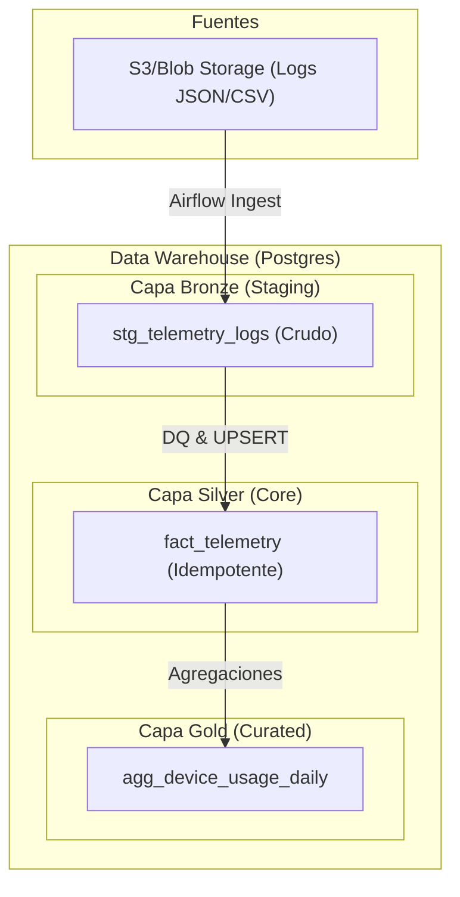

# Documentación Técnica Maestría: Proyecto Senior Data Engineer

Esta documentación proporciona una visión exhaustiva de la solución implementada para el procesamiento de logs de telemetría, siguiendo los estándares de la **Arquitectura Medallion** y las mejores prácticas de **Ingeniería de Datos** moderna.

---

## 1. Arquitectura de Datos: Modelo Medallion

La solución se basa en una arquitectura de tres capas (Bronze, Silver, Gold) para garantizar la trazabilidad, limpieza y utilidad del dato.



### Capa Bronze (Staging)
- **Objetivo**: Persistir los datos en su formato original.
- **Detalle**: Se utiliza una tabla de staging (`stg_telemetry_logs`) que actúa como zona de aterrizaje. No se aplican transformaciones complejas aquí para evitar la pérdida de información original.

### Capa Silver (Core)
- **Objetivo**: Datos limpios, normalizados e **idempotentes**.
- **Detalle**: Aquí es donde reside la lógica de negocio principal. Se realizan cruces, tipado de datos y, lo más importante, la validación de calidad.

### Capa Gold (Curated)
- **Objetivo**: Datos listos para el consumo de analítica y BI (ej. Power BI).
- **Detalle**: Tablas agregadas que facilitan la visualización sin necesidad de procesar millones de filas en cada consulta.

---

## 2. Ingesta Incremental e Idempotencia

### El Desafío de los 50 Millones
Manejar 50 millones de registros mensuales requiere una estrategia que evite los escaneos completos de tablas.

- **Particionamiento Lógico**: Utilizamos la `logical_date` de Airflow para procesar ventanas de tiempo específicas (diarias/horarias).
- **Particionamiento Físico**: En Postgres, las tablas están particionadas por rango de fecha, lo que permite el "Partition Pruning".

### Lógica UPSERT (ON CONFLICT)
Para garantizar que una re-ejecución del pipeline no duplique datos, implementamos una lógica de **UPSERT**:
```sql
INSERT INTO silver.fact_telemetry (...)
VALUES (...)
ON CONFLICT (id) 
DO UPDATE SET ...;
```
Esto asegura que si un registro con el mismo `id` ya existe, se actualice en lugar de fallar o duplicarse.

---

## 3. Observabilidad y Calidad de Datos (DQ)

### Umbral de Calidad del 5%
Se ha implementado un mecanismo de validación que detiene el pipeline si la calidad de los datos cae por debajo del estándar aceptable.
- **Métrica**: Ratio de registros con valores nulos en columnas críticas (`id`, `device_id`, `timestamp`).
- **Lógica**: Si el `null_ratio > 0.05`, el pipeline aborta automáticamente para proteger la integridad de las capas Silver y Gold.

### SLAs (Service Level Agreements)
Para procesos críticos (como la carga final de Power BI), hemos configurado SLAs en Airflow:
- **Alertas**: Si el proceso no finaliza antes de las 6:00 AM, se dispara un `sla_miss_callback`.
- **Notificación**: Se integran alertas automáticas (Slack/PagerDuty) para que el equipo de guardia actúe de inmediato.

---

## 4. Detalles de Implementación (Python)

Se corrigieron errores específicos en los scripts de soporte para asegurar un tipado estricto y compatibilidad con Pyre2.

### `generate_data.py`
Script encargado de simular el volumen de datos. Se optimizó el redondeo de métricas para evitar errores de sobrecarga de funciones:
- **Técnica**: Formateo de f-string `float(f"{val:.2f}")` para garantizar precisión decimal sin ambigüedad de tipos.

### `test_local.py`
Simulador local del pipeline. Se rediseñó para eliminar "errores internos" de linter:
- **Enfoque Funcional**: Se sustituyeron los bucles de conteo manual por funciones integradas (`len`, `sum`).
- **Idempotencia Local**: El script genera una previsualización de la consulta SQL real que se ejecutaría en producción, validando la lógica de `ON CONFLICT`.

---

## 5. Liderazgo Técnico y Mejores Prácticas

Como parte del rol Senior, se establecieron guías para el desarrollo del equipo:
- **No usar `SELECT *`**: Siempre listar columnas explícitamente para optimizar I/O y red.
- **Evitar OOM en Airflow**: Airflow es un orquestador. Las transformaciones pesadas deben hacerse en la base de datos (ELT) o en motores de cómputo externos (Spark/Snowflake).
- **Documentación Viva**: Cada directorio contiene un `__init__.py` para marcar de forma explícita la modularidad del código.

---
> [!TIP]
> Esta arquitectura está diseñada para ser agnóstica a la nube y puede escalarse fácilmente migrando los scripts de Python a tareas de Spark o implementándolos sobre arquitecturas de Lakehouse como Delta Lake.
