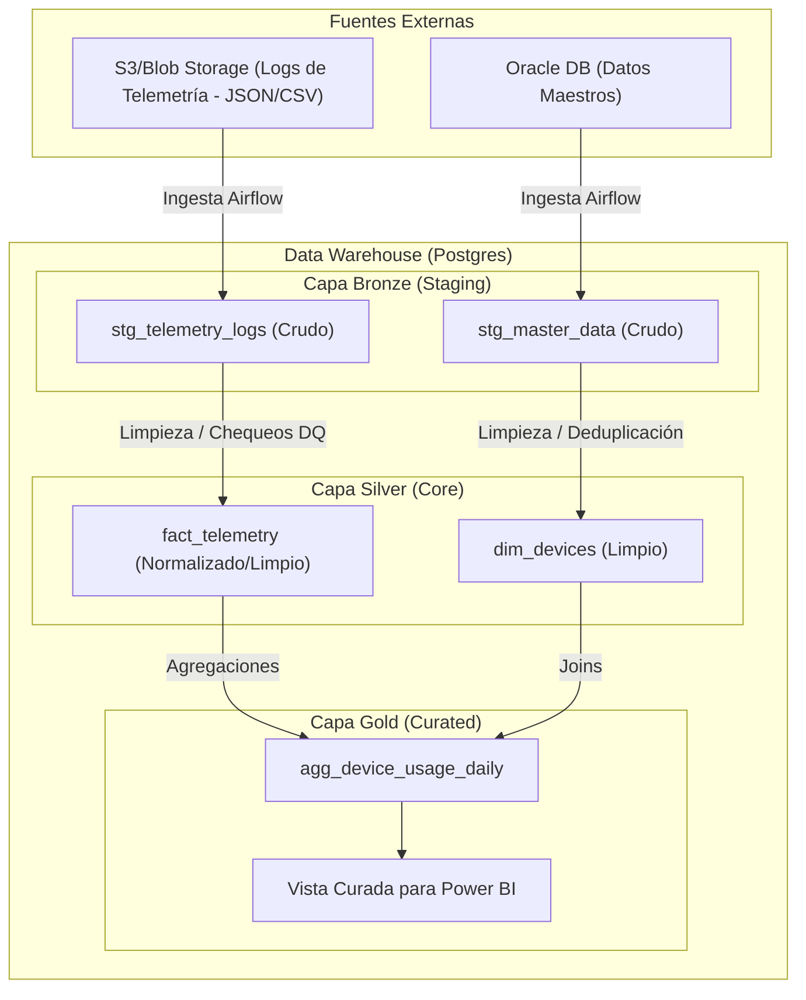

# Parte 1: Diseño de Arquitectura

## 1. Diagrama de Flujo de Datos (Arquitectura Medallion)

## 2. Estrategia de Carga Incremental: Particionamiento Lógico

Para una tabla que recibe **50 millones de registros mensuales**, se recomienda una estrategia de "Particionamiento Lógico" combinada con particionamiento físico en Postgres.

### Lógica Incremental
1.  **Extracción basada en Watermark**: Utilizar una columna `last_modified_at` o `event_timestamp` para extraer solo los registros nuevos o actualizados desde la última ejecución exitosa.
2.  **Indexación por Fecha Lógica**: Se utiliza la `logical_date` de Airflow para gestionar las particiones. Cada ejecución del DAG se dirige a una ventana de tiempo específica.

### Justificación Técnica
-   **Rendimiento**: El particionamiento físico de Postgres (ej. `PARTITION BY RANGE (event_date)`) permite al motor realizar "Partition Pruning", acelerando significativamente las consultas al escanear solo los bloques de datos relevantes.
-   **Escalabilidad**: Manejar 50M de registros al mes (aprox. 1.6M diarios) requiere evitar escaneos de tabla completa. El particionamiento lógico asegura que las re-ejecuciones solo afecten a un subconjunto pequeño de datos.
-   **Integridad**: Al usar un área de staging, podemos realizar validaciones de esquema y chequeos de Calidad de Datos (Parte 2) antes de mover los datos a la capa Core, evitando "fallos silenciosos" o snapshots corrompidos.
-   **Observabilidad**: Cada ejecución de partición lógica se puede rastrear individualmente, facilitando la identificación de brechas o fallos en periodos de tiempo específicos.
